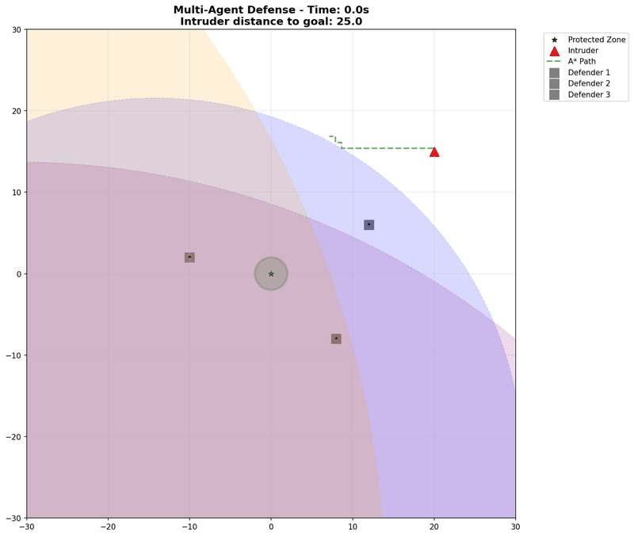

# Multi-Agent Defense Simulation

A high-performance Rust/Python implementation of decentralized dynamic interception using Apollonian Circles. This project demonstrates how multiple slower defenders can cooperatively protect a zone from a faster intruder using intelligent pathfinding and geometric control strategies.



## 🎯 Overview

The simulation implements a smart adversarial system where:
- **3 Defenders** (slower) must protect a circular zone from **1 Intruder** (faster)
- **Intruder AI** uses A* pathfinding with dynamic threat avoidance
- **Defenders** use Apollonian Circle geometry and cooperative control
- **Real-time simulation** with 50ms timesteps and smooth visualization

### Key Features

- **🔄 Three-State FSM**: Travel → Engage → Intercept state machine
- **🧠 Smart Intruder AI**: Grid-based A* pathfinding with threat maps
- **⚡ High Performance**: Rust core with Python simulation layer
- **📊 Rich Visualization**: Real-time Apollonian circles and pathfinding display
- **🎬 Multiple Scenarios**: Demonstrations of different strategies and outcomes

## 🚀 Quick Start

### Prerequisites
- Python 3.8+
- Rust (latest stable)
- maturin for Python-Rust bindings

### Installation

```bash
# Clone the repository
git clone https://github.com/your-username/multiagent-defense.git
cd multiagent-defense

# Set up Python environment
python3 -m venv venv
source venv/bin/activate  # On Windows: venv\Scripts\activate

# Install dependencies
pip install -r requirements.txt

# Build Rust library with Python bindings
cd interception_core
maturin develop
cd ..
```

### Run Simulation

```bash
# Run main simulation
python simulation/run_simulation.py

# Run system validation tests
python test_system_validation.py

# Generate multiple scenario demonstrations
python create_scenarios.py
```

## 🎬 Demonstration Scenarios

The simulation showcases various strategies and outcomes:

| Scenario | Description | Outcome | Key Features |
|----------|-------------|---------|--------------|
| [Intercept Success](scenario_gifs/scenario1_intercept_success.gif) | Quick defensive interception | Defenders Win | Direct intercept strategy |
| [Cooperative Defense](scenario_gifs/scenario3_engage_cooperative.gif) | Perimeter coverage optimization | Defenders Win | Engage state coordination |
| [Fast Breakthrough](scenario_gifs/fast_intruder_breakthrough.gif) | Speed advantage exploitation | **Intruder Wins** | Smart pathfinding victory |
| [Travel Positioning](scenario_gifs/scenario4_travel_positioning.gif) | Long-range repositioning | Defenders Win | Travel state movement |

📖 **[See complete scenario guide →](SCENARIO_GUIDE.md)**

## 🏗️ Architecture

### Hybrid Rust/Python Design

```
┌─────────────────────────────────────────┐
│             Python Layer                │
│  • Simulation orchestration            │
│  • Visualization & animation           │
│  • Scenario generation                 │
│  • A* pathfinding integration          │
└─────────────────────────────────────────┘
                    │
                    ▼
┌─────────────────────────────────────────┐
│              Rust Core                  │
│  • Apollonian circle geometry          │
│  • Three-state FSM controller          │
│  • Gradient descent optimization       │
│  • High-performance calculations       │
└─────────────────────────────────────────┘
```

### Core Components

- **`interception_core/`** - High-performance Rust library
  - `geometry.rs` - Apollonian circle calculations
  - `controller.rs` - Three-state FSM and control logic
  - `pathfinding.rs` - A* algorithm and threat mapping
  - `structs.rs` - Core data structures with Python bindings

- **`simulation/`** - Python simulation and visualization
  - `run_simulation.py` - Main simulation orchestrator
  - `smart_intruder.py` - Intelligent adversary AI
  - `visualizer.py` - Real-time matplotlib visualization
  - `config.py` - Simulation parameters and scenarios

## 🧮 The Algorithm

### 1. Apollonian Circles (Defender Strategy)

For each defender at position `P_d` facing an intruder at `P_i`, the **Apollonian Circle** defines their "Region of Dominance" - all points where they can guarantee interception given speed ratio `k = v_defender / v_intruder`.

```
Circle center: ((k²x_i - x_d)/(k² - 1), (k²y_i - y_d)/(k² - 1))
Circle radius: k * |P_d - P_i| / |k² - 1|
```

### 2. Three-State Finite State Machine

**Priority Order**: Intercept > Engage > Travel

```
┌─────────┐    Apollonian circle     ┌─────────┐
│ Travel  │───── intersects goal ────▶│ Engage  │
└─────────┘                          └─────────┘
     │                                    │
     │        Direct interception         │
     └─────────── opportunity ────────────┘
                      │
                      ▼
                ┌─────────┐
                │Intercept│ (Terminal)
                └─────────┘
```

- **Travel**: Move Apollonian circle toward goal
- **Engage**: Optimize cooperative perimeter coverage  
- **Intercept**: Direct interception (highest priority)

### 3. Smart Intruder AI

- **Grid-based A* pathfinding** with Manhattan distance heuristic
- **Dynamic threat maps** generated from defender Apollonian circles
- **Real-time replanning** every simulation frame (50ms)
- **Goal circle targeting** (not just center point)

## 📊 Performance & Validation

### Test Coverage
- ✅ **Geometry calculations** (Apollonian circles, intersections)
- ✅ **FSM state transitions** (Travel/Engage/Intercept logic)
- ✅ **A* pathfinding** (goal targeting, threat avoidance)
- ✅ **End condition detection** (interception/goal reach)
- ✅ **Integration scenarios** (multiple complete simulations)

### Benchmarks
- **Simulation Speed**: ~20x real-time on modern hardware
- **Frame Generation**: 50ms timesteps with smooth 10fps visualization
- **Pathfinding**: <1ms per A* calculation on 80x80 grid
- **Memory Usage**: <50MB for complete simulation

## 🔬 Research Applications

This implementation demonstrates key concepts in:

- **Multi-agent robotics** - Cooperative control strategies
- **Game theory** - Pursuit-evasion dynamics  
- **Computational geometry** - Apollonian circle applications
- **Path planning** - A* with dynamic obstacle avoidance
- **Distributed systems** - Decentralized decision making

## 🛠️ Development

### Project Structure
```
multiagent-defense/
├── interception_core/     # Rust library
│   ├── src/
│   └── Cargo.toml
├── simulation/            # Python simulation
│   ├── run_simulation.py
│   ├── smart_intruder.py
│   └── visualizer.py
├── scenario_gifs/         # Generated demonstrations
├── requirements.txt
└── README.md
```

### Building and Testing
```bash
# Build Rust library
cd interception_core
cargo test
maturin develop

# Run Python tests
cd ..
python test_system_validation.py
python test_pathfinding.py
```

### Key Dependencies
- **Rust**: `pyo3` (Python bindings), `numpy` integration
- **Python**: `matplotlib` (visualization), `numpy` (arrays)

## 📈 Future Enhancements

- [ ] **Multiple intruders** with coordination
- [ ] **Dynamic obstacles** in the environment  
- [ ] **Communication constraints** between defenders
- [ ] **3D simulation** with altitude considerations
- [ ] **Machine learning** for adaptive strategies
- [ ] **Real robot integration** with ROS

## 📄 License

MIT License - see [LICENSE](LICENSE) for details.

## 🙋 Contributing

Contributions welcome! Please read our [contributing guidelines](CONTRIBUTING.md) and submit pull requests.

---

**Built with ❤️ using Rust 🦀 and Python 🐍**