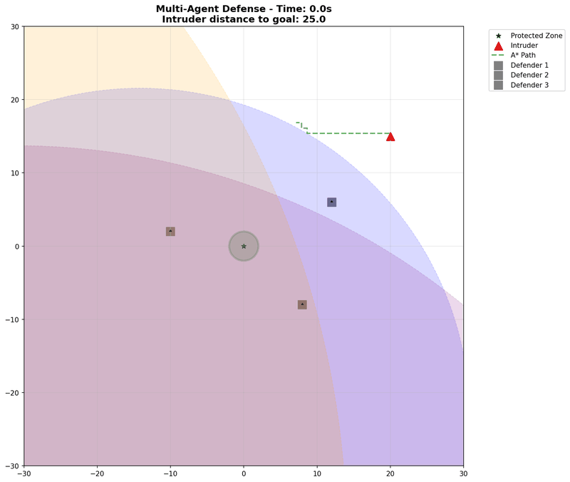
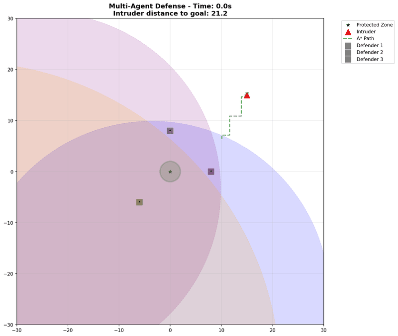
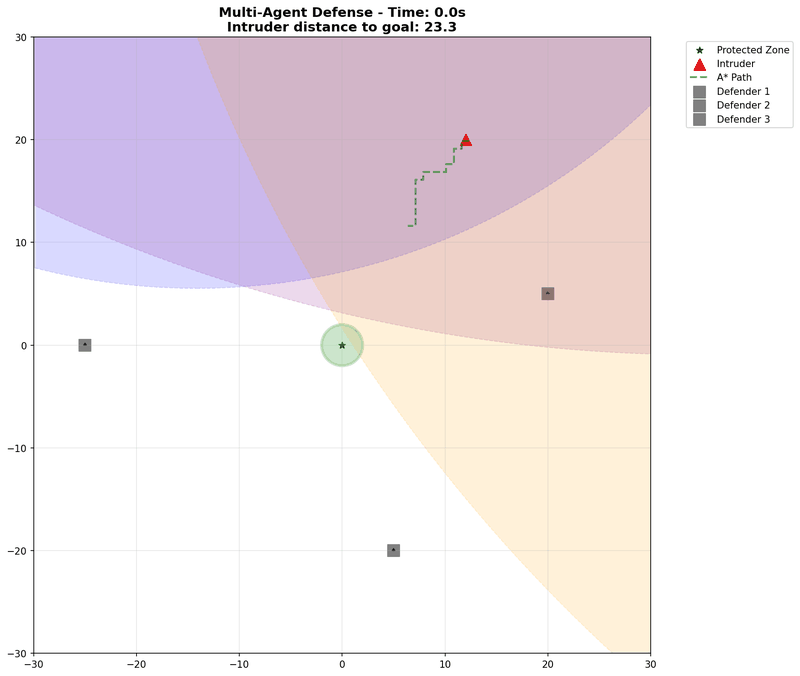
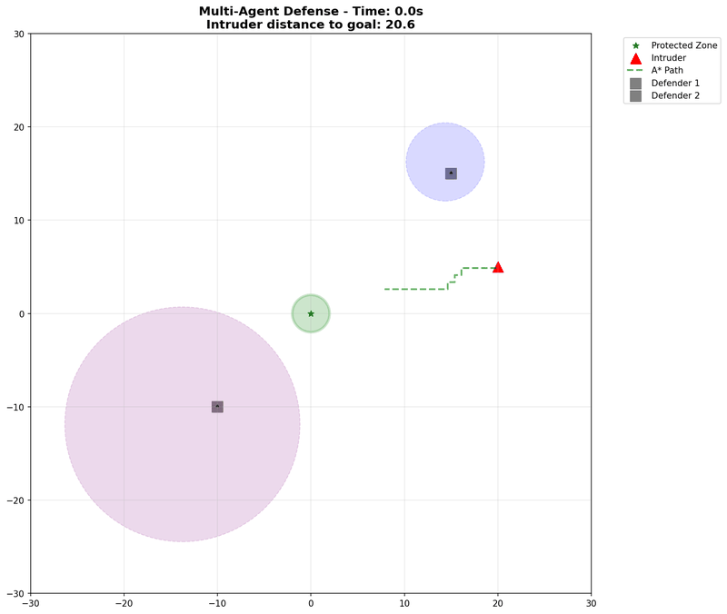
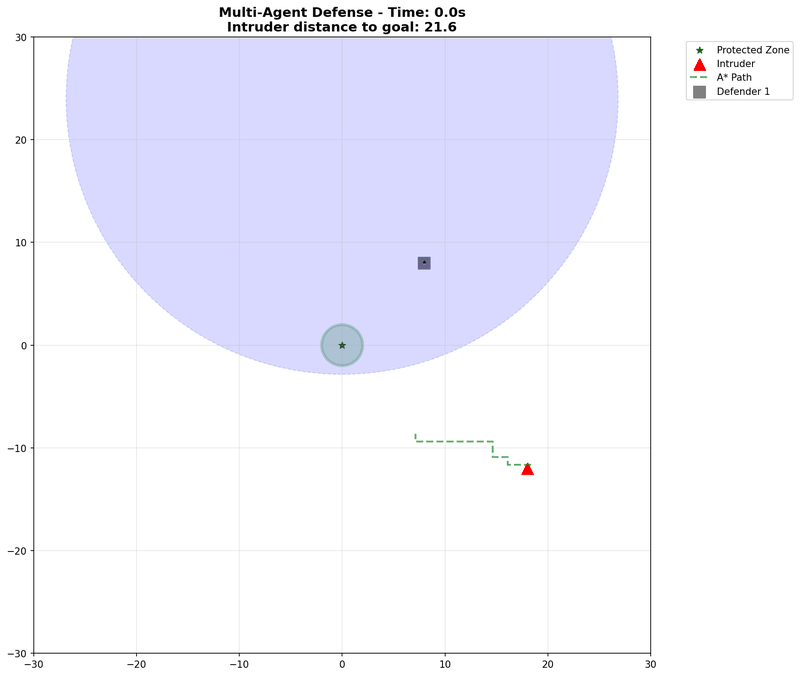
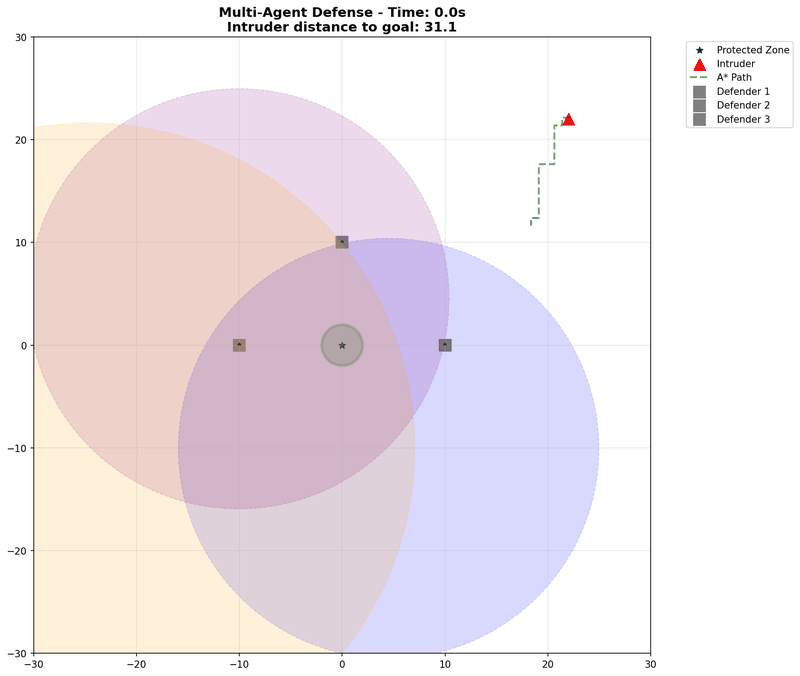
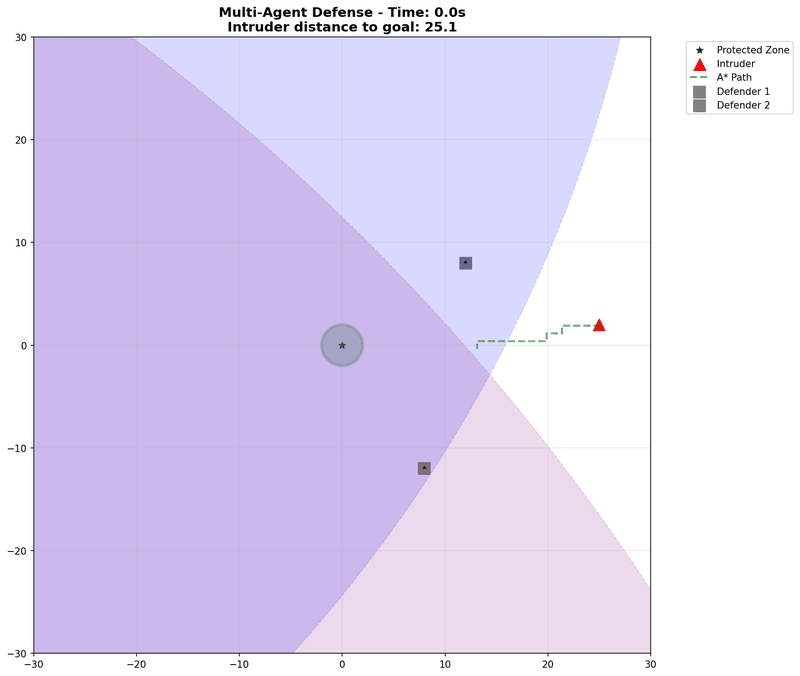

# Multi-Agent Defense Simulation Scenarios

This document showcases different scenarios demonstrating various strategies, FSM states, and outcomes in the multi-agent defense simulation.

## Overview

The simulation implements a decentralized dynamic interception system using Apollonian Circles, where multiple slower defenders protect a zone from a faster intruder using smart A* pathfinding.

### Key Features Demonstrated
- **Three-State FSM**: Travel → Engage → Intercept state transitions
- **Smart Intruder AI**: A* pathfinding with threat avoidance  
- **Apollonian Circle Geometry**: Region of dominance calculations
- **Cooperative Defense**: Dynamic perimeter coverage optimization

---

## 🎬 Scenario Demonstrations

### 1. **Successful Defense - Intercept Strategy**

**Configuration:**
- 3 Defenders (speed: 3.5) vs 1 Intruder (speed: 4.0)
- Speed ratio: 0.88 (defenders 88% of intruder speed)

**Outcome:** ✅ **Defenders Win** (3.4s)  
**Strategy:** Defenders quickly transition to **Intercept** state when intruder's path intersects their Apollonian circles. Shows direct interception without needing cooperative positioning.

**Key Observations:**
- All defenders immediately go to Intercept state (highest priority)
- Apollonian circles create overlapping "regions of dominance"
- Intruder A* pathfinding tries to avoid threat zones but gets caught

---

### 2. **Cooperative Defense - Engage State**  

**Configuration:**
- 3 Defenders (speed: 3.0) vs 1 Intruder (speed: 3.8)
- Speed ratio: 0.79, positioned around goal perimeter

**Outcome:** ✅ **Defenders Win** (6.2s)  
**Strategy:** Demonstrates **Engage** state cooperative defense where defenders optimize perimeter coverage while minimizing overlap.

**Key Observations:**
- Defenders initially in Engage state, coordinating coverage
- Gradient descent optimization balances coverage vs overlap penalty
- Transition to Intercept when direct interception becomes possible

---

### 3. **Travel State Positioning**

**Configuration:**  
- 3 Defenders (speed: 4.0) vs 1 Intruder (speed: 3.5)
- Defenders start far from goal, need repositioning

**Outcome:** ✅ **Defenders Win** (5.1s)  
**Strategy:** Shows **Travel** state where defenders move their Apollonian circles toward the goal before engaging.

**Key Observations:**
- Defenders begin in Travel state, moving circles toward goal
- Speed advantage (1.14 ratio) allows effective repositioning
- Demonstrates FSM state progression: Travel → Intercept

---

### 4. **Fast Intruder Breakthrough** 🚨

**Configuration:**
- 2 Defenders (speed: 2.0) vs 1 Intruder (speed: 6.0)  
- Speed ratio: 0.33 (extreme speed disadvantage)
- Poor initial defender positioning

**Outcome:** 🚨 **Intruder Wins** (4.0s)  
**Strategy:** Demonstrates successful intruder breakthrough when defenders are too slow and poorly positioned.

**Key Observations:**
- Extreme speed ratio makes Apollonian circles very small
- A* pathfinding successfully navigates around limited threat zones
- Defenders cannot reposition fast enough to intercept

---

### 5. **Single Defender Overwhelmed**

**Configuration:**
- 1 Defender (speed: 3.0) vs 1 Intruder (speed: 4.5)
- Speed ratio: 0.67, defender positioned suboptimally

**Outcome:** ✅ **Defenders Win** (5.7s)  
**Strategy:** Shows the challenge of single defender scenarios and the importance of positioning.

**Key Observations:**
- Single Apollonian circle limits coverage
- Intruder A* finds path around defender's region of dominance
- Close interception despite numerical disadvantage

---

### 6. **Smart Pathfinding Navigation**

**Configuration:**
- 3 Defenders (speed: 2.8) vs 1 Intruder (speed: 5.0)
- Defensive formation around goal

**Outcome:** ✅ **Defenders Win** (4.0s)  
**Strategy:** Demonstrates intelligent A* pathfinding attempting to navigate around defensive formations.

**Key Observations:**
- A* generates dynamic threat maps from Apollonian circles
- Real-time replanning as defenders move
- Grid-based movement with lattice navigation

---

### 7. **Close Call Near-Miss**

**Configuration:**
- 2 Defenders (speed: 3.8) vs 1 Intruder (speed: 4.0)
- Tight speed margins, close interception threshold

**Outcome:** ✅ **Defenders Win** (5.2s)  
**Strategy:** Shows high-tension scenarios with multiple near-miss interception attempts.

**Key Observations:**
- Multiple close encounters before successful interception
- Demonstrates precision of Apollonian circle calculations
- A* pathfinding adapts to changing threat landscapes

---

## 📊 Analysis Summary

| Scenario | Defenders | Intruder | Speed Ratio | Duration | Winner | Primary Strategy |
|----------|-----------|----------|-------------|----------|--------|------------------|
| Intercept Success | 3 @ 3.5 | 1 @ 4.0 | 0.88 | 3.4s | Defenders | Direct Intercept |
| Engage Cooperative | 3 @ 3.0 | 1 @ 3.8 | 0.79 | 6.2s | Defenders | Cooperative Coverage |
| Travel Positioning | 3 @ 4.0 | 1 @ 3.5 | 1.14 | 5.1s | Defenders | Repositioning |
| **Fast Breakthrough** | 2 @ 2.0 | 1 @ 6.0 | **0.33** | 4.0s | **Intruder** | **Speed Advantage** |
| Single Defender | 1 @ 3.0 | 1 @ 4.5 | 0.67 | 5.7s | Defenders | Optimal Positioning |
| Smart Pathfinding | 3 @ 2.8 | 1 @ 5.0 | 0.56 | 4.0s | Defenders | Formation Defense |
| Close Call | 2 @ 3.8 | 1 @ 4.0 | 0.95 | 5.2s | Defenders | Precision Timing |

## 🎯 Key Insights

### FSM State Behavior
- **Travel State**: Used when Apollonian circle doesn't intersect goal
- **Engage State**: Cooperative defense with overlap minimization  
- **Intercept State**: Terminal state with direct interception (highest priority)

### Critical Speed Ratios
- **> 0.8**: Defenders have good interception capability
- **0.5 - 0.8**: Requires good positioning and coordination
- **< 0.5**: Intruder breakthrough becomes likely

### A* Pathfinding Intelligence
- Dynamic threat map generation from Apollonian circles
- Real-time replanning every simulation frame
- Grid-based movement with threat penalty weighting
- Successfully targets goal circle (not just center)

### Geometric Strategy
- Apollonian circles define "regions of dominance"
- Speed ratio determines circle size and effectiveness
- Cooperative coverage optimizes perimeter protection
- Line-circle intersection enables precise interception timing

---

## 🛠️ Technical Implementation

The scenarios demonstrate the complete system architecture:

- **Rust Core**: High-performance geometry and control algorithms
- **Python Simulation**: Visualization and A* pathfinding integration
- **Hybrid Architecture**: Optimal performance with flexible scripting
- **Real-time Dynamics**: 50ms timesteps with smooth animation

Each GIF represents ~3-7 seconds of simulation time with frame captures every 100ms, showcasing the real-time decision making and adaptive behaviors of both defenders and intruder AI systems.